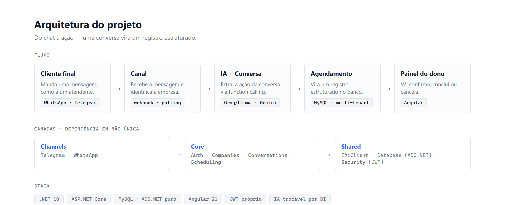
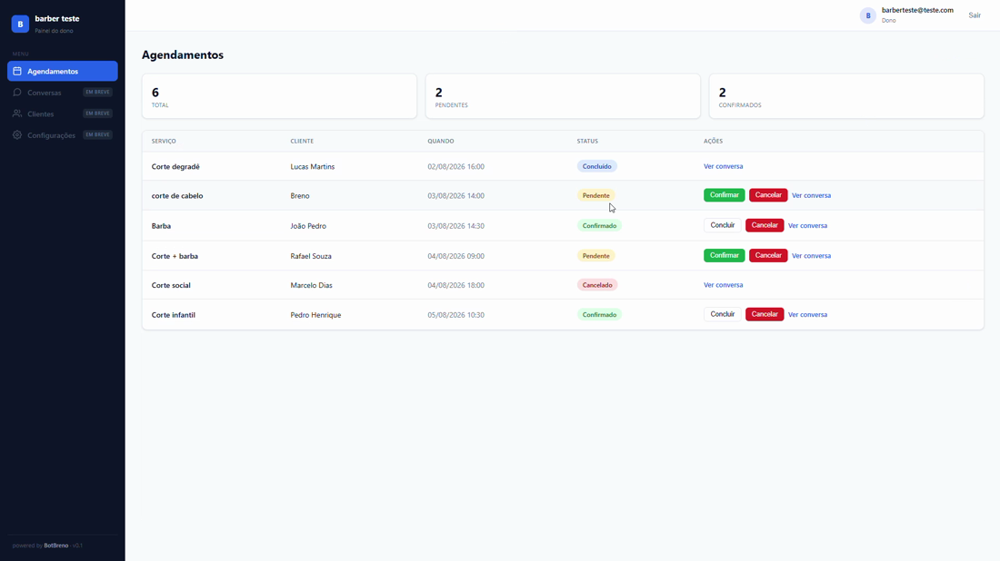

# BotSaaS

Plataforma SaaS de atendimento por IA por chat (WhatsApp/Telegram) para pequenos negócios. O bot é
**transacional**: o cliente final faz um **pedido** ou **marca um horário** pela conversa,
e isso vira um **registro estruturado** que o dono do negócio acompanha num painel.

> Projeto de portfólio em desenvolvimento — foco em arquitetura limpa e integração de IA
> ponta a ponta. Construído incrementalmente, com cada decisão documentada.



O cliente marca um horário conversando naturalmente; a IA extrai a ação e ela vira um agendamento no painel do dono:



## Stack

| Camada | Escolha |
|---|---|
| Backend | C# .NET 10, ASP.NET Core Web API |
| Banco | MySQL |
| Acesso a dados | **ADO.NET puro** (sem ORM/Dapper) + driver MySqlConnector |
| Auth | JWT próprio (HMAC-SHA256) + BCrypt |
| IA | Google Gemini ou Groq/Llama (atrás de interface neutra `IAiClient`, trocável) |
| Canais | **Telegram** (long polling, funcionando) · WhatsApp (webhook, planejado) |
| Frontend | Angular 21 (standalone, signals) — painel do dono |

## Arquitetura

Monólito modular com dependência em mão única:

```
Channels/      → entrada por mensagem (Telegram, WhatsApp)
Modules/       → nichos/verticais (ex: Barber): consomem Capabilities + regras próprias
Capabilities/  → ações transacionais reusáveis (Appointments; futuro: Ordering...)
Core/          → kernel universal (Auth, Users, Companies, Conversations, AI)
Shared/        → base técnica neutra (Results, Security, Database, AI)

dependência (mão única):  Channels / Modules  →  Capabilities  →  Core  →  Shared
```

**Capability** = o que a plataforma sabe FAZER (agendar, pedir), reusável por vários nichos.
**Module** = um TIPO de negócio (barbearia), que consome capabilities e pluga regras próprias.

Decisões de design que guiam o código:

- **Multi-tenant** por `CompanyId`, isolado via JWT nas rotas do dono (o tenant sai sempre do token).
  Num canal (sem JWT), o tenant é resolvido pela identidade do canal.
- **Repositório "burro"** — só executa SQL ou propaga a exceção do driver; tradução de
  erro fica nas camadas de cima (Service → código semântico → Controller → HTTP).
- **Transação explícita** via `DbSession` compartilhado na requisição (registro de
  Company + User é atômico: tudo ou nada).
- **Interfaces neutras** escondem a tecnologia — `IDatabase`, `IPasswordHasher`,
  `IJwtTokenGenerator` e o cliente de IA. Trocar de provedor é trocar uma implementação.
- **Result Pattern** para fluxo de erro sem exceções de controle.

## Funcionalidades atuais

- ✅ Cadastro de empresa + usuário (transacional)
- ✅ Login com verificação BCrypt e emissão de JWT
- ✅ Rota protegida lendo a identidade/tenant das claims do token
- ✅ Integração com IA respondendo via API — dois provedores trocáveis por DI (Gemini e Groq/Llama)
- ✅ Conversas com histórico persistido no banco (memória por cliente) — testado e2e
- ✅ Extração de ação via **function calling** — o modelo extrai um `Agendamento` estruturado da conversa e **grava no banco** (testado e2e)
- ✅ Visão do dono — `GET /api/appointments` lista os agendamentos da empresa (tenant do JWT), testado e2e
- ✅ **Painel do dono em Angular** — login + tabela de agendamentos + **gestão de status** (confirmar/concluir/cancelar) + **ver a conversa** que gerou cada agendamento, testado e2e
- ✅ **Canal de mensagens real (Telegram)** — bot por *long polling* roteando cada mensagem pelo mesmo `ConversationService` da API; testado e2e (conversa real no Telegram → agendamento no painel)
- 🔜 Webhook de WhatsApp, regras por nicho (disponibilidade/anti-double-booking), cobrança

## Endpoints

| Método | Rota | Descrição |
|---|---|---|
| `POST` | `/api/auth/register` | Cria empresa + usuário |
| `POST` | `/api/auth/login` | Autentica e devolve o JWT + o nome da empresa (white-label) |
| `GET`  | `/api/me` | Identidade do requisitante (requer Bearer) |
| `POST` | `/api/conversations` | Processa uma mensagem do cliente e devolve a resposta da IA (requer Bearer; entrada dev/token) |
| `GET`  | `/api/appointments` | Lista os agendamentos da empresa do requisitante (requer Bearer; a "visão do dono") |
| `PATCH` | `/api/appointments/{id}/status` | Atualiza o status de um agendamento (requer Bearer; tenant-scoped) |
| `GET`  | `/api/conversations/{id}/messages` | Mensagens de uma conversa (requer Bearer; tenant-scoped) — o chat por trás de um agendamento |

> O **canal de Telegram** não é um endpoint: roda como serviço em background (*long polling*) e
> injeta cada mensagem no mesmo fluxo do `/api/conversations`, resolvendo o tenant por configuração.
> Em produção, a entrada será o **webhook** (o `companyId` virá do canal, não de um token).

## Como rodar

**Pré-requisitos:** SDK do .NET 10, MySQL (ex: XAMPP), uma chave de API de IA (Google Gemini ou Groq).

1. Clone o repositório e crie um arquivo `.env` na raiz.
2. Preencha o `.env` com suas variáveis: banco (`DB_HOST/USER/PASSWORD/NAME/PORT`),
   JWT (`JWT_SECRET/ISSUER/AUDIENCE/EXPIRES_HOURS`), IA (`GEMINI_API_KEY/MODEL` e/ou
   `GROQ_API_KEY/MODEL`) e `SYSTEM_PROMPT`. O provedor ativo é escolhido na DI (`Program.cs`).
   - **Opcional (canal Telegram):** `TELEGRAM_BOT_TOKEN` (do @BotFather) e `TELEGRAM_TEST_COMPANY_ID`
     (a empresa que recebe os agendamentos do bot). Sem essas vars, o canal fica desligado e o resto roda normal.
3. Crie o banco e as tabelas `companies`, `users`, `conversations`, `messages` e `appointments` no MySQL.
4. Rode:
   ```bash
   dotnet run
   ```

A API sobe em `http://localhost:5069`. Se o Telegram estiver configurado, o console mostra `Telegram polling iniciado.`

**Frontend (painel do dono):**
```bash
cd web
npm install
ng serve
```
Abre em `http://localhost:4200`. Precisa do backend no ar (CORS já libera `localhost:4200`).

## Estrutura

```
src/
├── Channels/
│   └── Telegram/     canal de teste (long polling) → injeta no ConversationService
├── Core/             kernel universal
│   ├── Auth/          registro e login (orquestra o cadastro)
│   ├── Users/         entidade User + gestão
│   ├── Companies/     os tenants (empresas clientes)
│   └── Conversations/ conversa + mensagens + roteador genérico de tools (IChatTool)
├── Capabilities/     ações transacionais reusáveis
│   └── Appointments/  agendamentos (Appointment + service + repo + Tools/RegisterAppointmentTool)
├── Modules/          nichos/verticais
│   └── Barber/        regras do nicho (disponibilidade) — em construção
└── Shared/
    ├── Results/     Result Pattern
    ├── Security/    hash de senha + JWT
    ├── Database/    conexão e sessão de transação
    └── AI/          cliente de IA (Gemini e Groq, atrás de IAiClient)

web/                 painel do dono em Angular (login + agendamentos + gestão de status)
```
